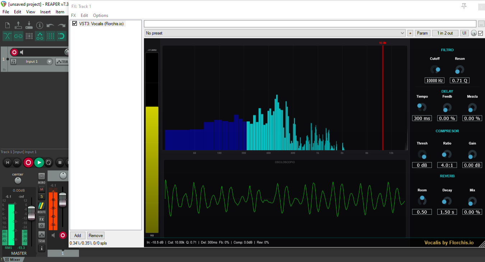

# 🎤 Vocalis by Florchis.io

Plugin de procesamiento de voz en tiempo real.



## 🎛️ Características

- **Compresor**: Threshold, Ratio, Makeup Gain
- **Reverb**: Room Size, Decay, Mix
- **Filtro pasa-bajos**: Cutoff (200Hz-20kHz), Resonancia
- **Delay**: Tiempo (0-1000ms), Feedback, Mix
- **Espectro logarítmico** en tiempo real
- **Osciloscopio** de forma de onda
- **VU Meter** con colores

## 🖥️ Formatos

- VST3
- AU (Audio Unit)
- Standalone

## 📥 Instalación

Copiá la carpeta del plugin compilado a:

| Sistema | Ruta |
|---------|------|
| **Windows VST3** | `C:\Program Files\Common Files\VST3\` |
| **Mac VST3** | `/Library/Audio/Plug-Ins/VST3/` |
| **Mac AU** | `/Library/Audio/Plug-Ins/Components/` |

## 🛠️ Compilar

```bash
git clone https://github.com/florsol99/Vocalis.git
# Abrir Vocalis.jucer en Projucer
# Seleccionar IDE y compilar
```

## 🛠️ Construido con

[JUCE](https://juce.com/) - Framework de audio C++

Creado por Florchis.io
